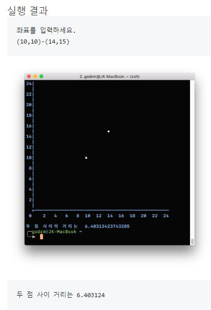
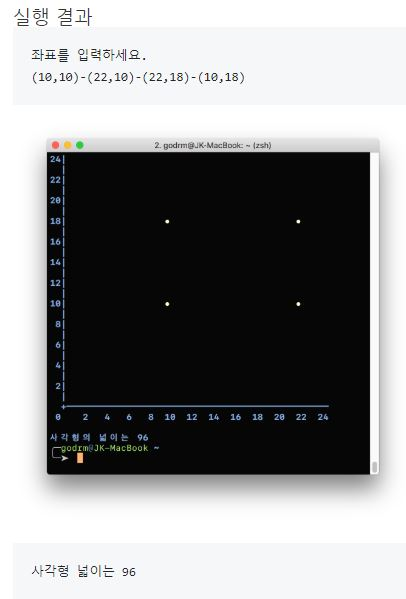
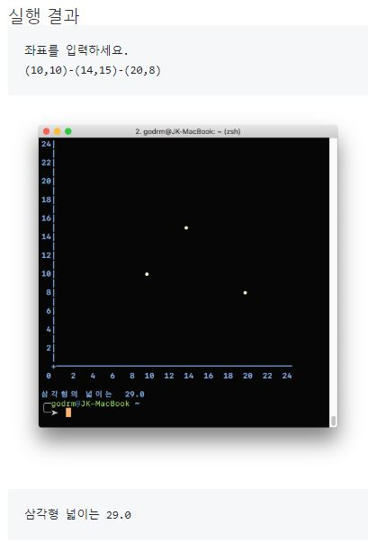
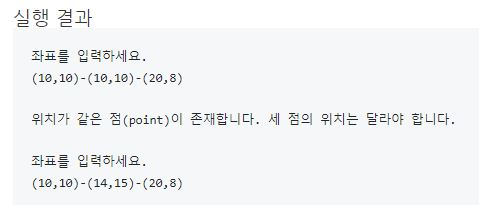

# java-coordinate
좌표계산기 미션을 진행하기 위한 저장소

## 우아한테크코스 코드리뷰
* [온라인 코드 리뷰 과정](https://github.com/woowacourse/woowacourse-docs/blob/master/maincourse/README.md)

## 차량에 따른 연료 주입 실습

### 기능 요구사항

- 우리 회사는 렌터카를 운영하고 있다. 현재 보유하고 있는 차량은 Sonata 2대, Avante 1대, K5 2대로 총 5대의 차량을 보유하고 있다.
- 우리 회사는 고객이 인터넷으로부터 예약할 때 여행할 목적지의 대략적인 이동거리를 입력 받는다. 이 이동거리를 활용해 차량 별로 필요한 연료를 주입한다.
- 차량 별로 주입해야 할 연료량을 확인할 수 있는 보고서를 생성해야 한다.

- 각 차량별 연비는 다음과 같다.
    * Sonata : 10km/리터
    * Avante : 15km/리터
    * K5 : 13km/리터
    
# 좌표계산기 1단계 - 선 길이

### 기능 요구사항

- 사용자가 점에 대한 좌표 정보를 입력하는 메뉴를 구성한다.
- 좌표 정보는 괄호"(", ")"로 둘러쌓여 있으며 쉼표(,)로 x값과 y값을 구분한다.
- X, Y좌표 모두 최대 24까지만 입력할 수 있다.
- 입력 범위를 초과할 경우 에러 문구를 출력하고 다시 입력을 받는다.
- 정상적인 좌표값을 입력한 경우, 해당 좌표에 특수문자를 표시한다.
- 좌표값을 두 개 입력한 경우, 두 점을 있는 직선으로 가정한다. 좌표값과 좌표값 사이는 '-' 문자로 구분한다.
- 직선인 경우는 두 점 사이 거리를 계산해서 출력한다.

### 구현 기능

- 점(Point)
    1. [예외 처리] 좌표가 범위를 벗어나는 경우
    2. 두 점 사이의 거리 : 유클리드 거리(euclidean Distance) 공식 사용

- 선(Line)
    1. [예외 처리] 두 점이 중복될 경우
    2. 선의 길이를 구한다.

------

# 좌표계산기 2단계 - 사각형 면적

### 기능 요구사항

- 좌표값을 두 개 입력한 경우, 두 점을 있는 직선으로 가정한다. 좌표값과 좌표값 사이는 '-' 문자로 구분한다.
- 좌표값을 네 개 입력한 경우, 네 점을 연결하는 사각형으로 가정한다.
  - 네 점이 뒤틀어진 사다리꼴이나 마름모는 제외하고 직사각형만 허용하도록 검사한다.
  - 사각형인 경우 사각형의 넓이를 계산해서 출력한다.

### 구현 기능

- 점(Point)
    1. [예외 처리] 좌표가 범위를 벗어나는 경우
    2. 두 점 사이의 거리 : 유클리드 거리(euclidean Distance) 공식 사용
    3. 세 점으로 이루어지는 각도

- 선(Line)
    1. [예외 처리] 두 점이 중복될 경우
    2. 선의 길이를 구한다.
    
- 직사각형(Rectangle)
    1. [예외 처리] 중복된 점이 있을 경우
    2. [예외 처리] 네 점이 직사각형이 안되는 경우 : 네 각의 크기가 직각인지 확인
    3. 직사각형의 넓이 구하기 : width * height

------

# 좌표계산기 3단계 - 삼각형 면적

### 기능 요구사항

- 좌표값을 두 개 입력한 경우, 두 점을 있는 직선으로 가정한다. 좌표값과 좌표값 사이는 '-' 문자로 구분한다.
- 좌표값을 세 개 입력한 경우, 세 점을 연결하는 삼각형으로 가정한다.
- 삼각형인 경우 삼각형의 넓이를 계산해서 출력한다.

### 구현 기능

- 점(Point)
    1. [예외 처리] 좌표가 범위를 벗어나는 경우
    2. 두 점 사이의 거리 : 유클리드 거리(euclidean Distance) 공식 사용
    3. 세 점으로 이루어지는 각도

- 선(Line)
    1. [예외 처리] 두 점이 중복될 경우
    2. 선의 길이를 구한다.
    
- 직사각형(Rectangle)
    1. [예외 처리] 중복된 점이 있을 경우
    2. [예외 처리] 네 점이 직사각형이 안되는 경우 : 네 각의 크기가 직각인지 확인
    3. 직사각형의 넓이 구하기 : width * height
    
- 삼각형(Triangle)
    1. [예외 처리] 중복된 점이 있을 경우
    2. [예외 처리] 세 점이 삼각형이 안되는 경우 : 임의의 두 개의 각이 0도 이거나 180도 인지 확인
    3. 삼각형의 넓이 구하기 : 헤론(heron)의 공식 사용

------

# 좌표계산기 4단계 - 상속 적용

### 기능 요구사항

- 각 좌표별 기능 요구사항은 앞의 1,2,3단계와 같다.
- 입력하는 점의 수에 따라 선, 사각형, 삼각형을 판단해 점수 계산이 가능하도록 한다.
- 입력하는 값이 유효한지를 판단해 유효하지 않은 값을 입력하는 경우 다시 입력하도록 한다.
- 사용자가 입력한 점 중에서 같은 위치의 점(point)을 입력하는지 체크해 같은 점을 입력하는 경우 다시 입력하도록 한다.

### 구현 기능

- 점(Point)
    1. [예외 처리] 좌표가 범위를 벗어나는 경우
    2. 두 점 사이의 거리 : 유클리드 거리(euclidean Distance) 공식 사용
    3. 세 점으로 이루어지는 각도

- 선(Line)
    1. [예외 처리] 두 점이 중복될 경우
    2. 선의 길이를 구한다.
    
- 직사각형(Rectangle)
    1. [예외 처리] 중복된 점이 있을 경우
    2. [예외 처리] 네 점이 직사각형이 안되는 경우 : 네 각의 크기가 직각인지 확인
    3. 직사각형의 넓이 구하기 : width * height
    
- 삼각형(Triangle)
    1. [예외 처리] 중복된 점이 있을 경우
    2. [예외 처리] 세 점이 삼각형이 안되는 경우 : 임의의 두 개의 각이 0도 이거나 180도 인지 확인
    3. 삼각형의 넓이 구하기 : 헤론(heron)의 공식 사용
    
- 입력(Input)
    1. [예외 처리] 유효하지 않은 범위의 좌표 입력 시
    2. [예외 처리] 중복된 좌표를 입력 시
    3. 입력한 점의 수에 따른 선, 사각형, 삼각형을 생성
    

------

# 좌표계산기 5단계 - 인터페이스 적용

### 기능 요구사항

- 기능 요구사항은 앞의 1,2,3단계와 같다

### 구현 기능